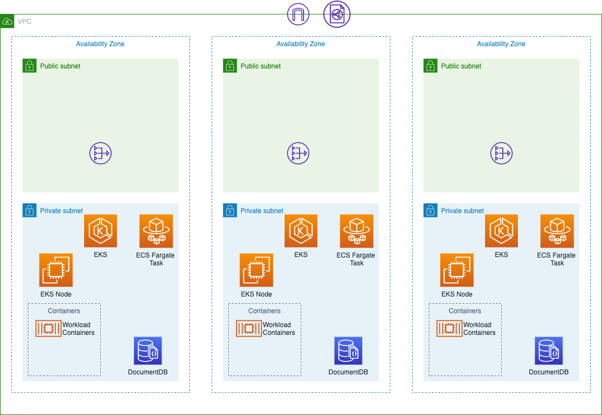

### Next steps for App Mesh Demonstration

For the next steps, we will look at routing based on headers first of all and then extend the application by deploying a service to ECS Fargate and integrating it with th existing mesh to demonstrate how different compute primitives can be used and share the same mesh.

## Reset the App Mesh routing to enable calls to all the services, frontend, backend and db

```
kubectl apply -f ../deploy/traffic/reset.yaml
```

Now lets look at the configuration that we can apply to the VirtualRouter for the frontend and implement header-based routing:

```
apiVersion: appmesh.k8s.aws/v1beta2
kind: VirtualRouter
metadata:
  namespace: my-apps
  name: frontend-virtual-router
spec:
  listeners:
    - portMapping:
        port: 8080
        protocol: http
  routes:
    - name: user-agent-route
      priority: 1
      httpRoute:
        match:
          prefix: /
          headers:
            - name: "user-agent"
              invert: false
              match:  
                regex: ".*Macintosh.*"
        action:
          weightedTargets:
            - virtualNodeRef:
                name: frontend-v2
              weight: 1
    - name: frontend-route
      priority: 2
      httpRoute:
        match:
          prefix: /
        action:
          weightedTargets:
            - virtualNodeRef:
                name: frontend-v1
              weight: 1
            - virtualNodeRef:
                name: frontend-v2
              weight: 1
```

Pay particular note to the priority that is attached to each route. In this example, the user-agent-route will be evaluated before any other weighting so we can use this to force traffic to hit a defined service based on the content of the user-agent header. Here we are sending any traffic coming from Apple operating systems to frontendv2.

Change the string to suit whatever browser you want to test from. If you're unsure about your user-agent you can visit [https://www.whatsmyua.info/](https://www.whatsmyua.info/) and see the detail. The match being used is a regex so replace Macintosh with another word so you can verify differing behaviour. 


```
kubectl apply -f ../deploy/traffic/frontend-user-agent-route.yaml
```

Once happy the behaviour is working as expected, reset the weightings back to running across all services:

```
kubectl apply -f ../deploy/traffic/reset.yaml
```

## Launch an ECS Fargate Service 

There's a CloudFormation template in the setup directory that will launch an ECS Cluster and a version of the frontend service that will only talk to the DB backend. Remember that the DB backend is being made available via a Cloud Map resource of db.private-example.com. The backends are only accessible within the cluster so we're not calling them from this service. 

Launch the ECS CloudFormation by running the following step:

```
./ecsdeploy.sh
```

The architecture now looks as follows now we've added an ECS Fargate Service:



This will launch the Cluster, create the task definitions and start the ECS Service. The script will also update the frontend-virtual-router in App Mesh to add frontend-v3 to the route table with equal weighting to the V1 and V2 frontends. 

Go back to the browser with the application running and hit refresh a few times until the V3 frontend appears. This can demonstrate how App Mesh can be leveraged to connect different compute resources together with observability and tracing capability but without Developers needing to code intrumentation into their apps and allowing freedom of choice of how workloads are run.

the logical view of the application now looks as follows with the ECS Fargate service circled in red:


## Cleanup 

Running the `cleanup.sh` script from the `setup` folder should tear down the resources however the Cloud9 desktop and IAM Role, eks-admin, should be deleted from the console. 

